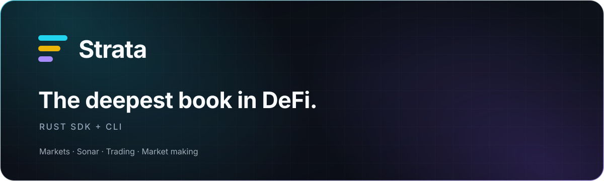

<p align="center">
  
</p>

<h1 align="center">Strata SDK for Rust</h1>

<p align="center">
  Native, typed access to live Strata markets and Sonar quotes.
</p>

<p align="center">
  <a href="https://stratabook.org/docs/agent-sdks">Documentation</a>
  ·
  <a href="https://github.com/alsk1992/strata-sdk-ts">TypeScript</a>
  ·
  <a href="https://github.com/alsk1992/strata-mcp">MCP</a>
  ·
  <a href="https://stratabook.app">Strata</a>
</p>

Build market monitors, pricing services, terminal workflows, and native
integrations against Strata's public contract. The SDK is async, uses Rustls,
and keeps token economics exact across every boundary.

## Start with a live quote

```toml
[dependencies]
strata-public-contract = "0.1"
strata-sdk = "0.1"
```

```rust
use strata_public_contract::{QuoteRequest, QuoteSide, DEFAULT_SLIPPAGE_BPS};
use strata_sdk::StrataClient;

# async fn run() -> Result<(), Box<dyn std::error::Error>> {
let strata = StrataClient::production()?;

let quote = strata
    .quote(QuoteRequest {
        market_id: "SOL/USDC".into(),
        side: QuoteSide::Sell,
        amount_in_atoms: "10000000".into(),
        slippage_bps: DEFAULT_SLIPPAGE_BPS,
    })
    .await?;

println!("Sonar output: {}", quote.amount_out_atoms);
println!("Minimum:      {}", quote.minimum_output_atoms);
println!("Price impact: {}%", quote.price_impact_pct);
# Ok(())
# }
```

Sonar is Strata's unified liquidity and matching system. One request produces
one decision-ready economic result for the whole Strata market.

## Why build with it

| | |
| --- | --- |
| **Native types** | Requests, responses, capabilities, markets, and errors are ordinary Rust types. |
| **Exact by construction** | Token amounts remain decimal atomic strings instead of passing through floats. |
| **Strict at the boundary** | Compatibility, quote binding, lifetime, and economics are checked before data reaches your application. |
| **Async and portable** | A small Reqwest client with Rustls works cleanly in services and command-line tools. |
| **One mental model** | Rust, TypeScript, MCP, and both CLIs share the same public contract. |

## Take it to the terminal

Install the native CLI:

```sh
cargo install strata-agent-cli
```

Discover markets and request a Sonar quote:

```sh
strata-agent markets

strata-agent quote \
  --market SOL/USDC \
  --side sell \
  --amount-atoms 10000000
```

Use `--json` for scripts, pipes, and agents:

```sh
strata-agent quote \
  --market SOL/USDC \
  --side sell \
  --amount-atoms 10000000 \
  --json
```

## Workspace

| Crate | Use it when… |
| --- | --- |
| [`strata-sdk`](crates/strata-sdk) | You want the async Strata client |
| [`strata-public-contract`](crates/strata-public-contract) | You need shared models without an HTTP client |
| [`strata-agent-cli`](crates/strata-agent-cli) | You want Strata and Sonar in a terminal |

## Read a Sonar quote

| Field | What you can decide from it |
| --- | --- |
| `amount_in_consumed_atoms` | How much input the quote expects to use |
| `amount_out_atoms` | The quoted output |
| `minimum_output_atoms` | The lowest output allowed by the requested tolerance |
| `input_fee_atoms` / `output_fee_atoms` | Which token pays each fee and how much |
| `reference_price` | The public reference price used for context |
| `price_impact_pct` | Estimated price impact |
| `expires_at_ms` | When to discard the quote and request a fresh one |

Amounts are unsigned base-10 strings in atomic units. That representation is
deliberate: parsing through floating point would make financial values less
exact, not more convenient.

### Optional execution tolerance

`DEFAULT_SLIPPAGE_BPS` is `0`, so the minimum output equals the quoted output.
This is separate from price impact, which describes the depth consumed by the
quote itself.

Choose a non-zero `slippage_bps` only when you are willing to accept less
output in exchange for greater execution tolerance. The returned
`minimum_output_atoms` remains the authoritative floor, and the requested
tolerance can affect which Sonar result is viable.

## Choose your Strata interface

| You are building… | Start here |
| --- | --- |
| A native service, bot, or Rust CLI | This SDK |
| A TypeScript application or browser experience | [Strata SDK for TypeScript](https://github.com/alsk1992/strata-sdk-ts) |
| An AI agent that should call Strata directly | [Strata MCP](https://github.com/alsk1992/strata-mcp) |
| Better Strata judgment inside a coding agent | [Strata Agent Skills](https://github.com/alsk1992/strata-agent-skills) |

## Current release

`0.1.x` covers market discovery and read-only Sonar quotes. It does not prepare,
sign, or submit transactions and never needs wallet or private-key material.

## Resources

- [Agent quick start](https://stratabook.org/docs/hello-agents)
- [SDK documentation](https://stratabook.org/docs/agent-sdks)
- [Issues and feature requests](https://github.com/alsk1992/strata-sdk-rs/issues)
- [Security policy](SECURITY.md)

Licensed under either [Apache-2.0](LICENSE-APACHE) or [MIT](LICENSE-MIT).
